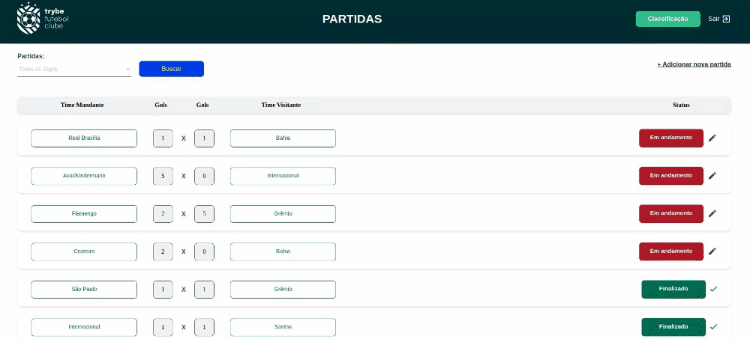

<h1 align='center'>
	⚽️ TFC - Trybe Futebol Clube!
</h1>
<p align='center'>
	O TFC é um site informativo sobre partidas e classificações de futebol!</br>
	:rocket: Feito durante o curso de desenvolvimento <a href="https://www.betrybe.com/">Trybe</a><br>
	⚒️ with Typescript, NodeJS, Express, MySql(Sequelize)
</p>
<div align="center">

  <a href=""></a>
  <a href=""></a>
  <a href=""></a>
  <a href=""></a>
  
</div>

  <p align="center">
    <a href="#about">About</a> •
    <a href="#rodar-localmente">Rodar Localmente</a> •
    <a href="#rodar-testes">Rodar Testes</a> •
    <a href="#cobertura-de-testes">Cobertura de Testes</a> •
    <a href="#lista-de-requisitos">Lista de Requisitos</a> •
    <a href="#tech-stack">Tech Stack</a>
  </p>

---

<div align="center">
    
</div>

## About

Neste projeto tivemos 4 dias para desenvolver um back-end dockerizado para se integrar à um front-end já existente.</br>
Foi desenvolvida uma API REST(utilizando o método `TDD`) integrada à um banco de dados MySQL, usando o ORM Sequelize.

Conhecimentos avaliados:
 - Realizar a dockerização dos apps, network, volume e compose;
 - Modelar dados com **MySQL** através do **Sequelize**;
 - Criar e associar tabelas usando `models` do `sequelize`;
 - Construir uma **API REST** com endpoints para consumir os models criados;
 - Respostas respeitando o <a href="https://developer.mozilla.org/pt-BR/docs/Web/HTTP/Status">status HTML</a> de acordo;
 - Validar as rotas internas utilizando Token `JWT`;
 - Fazer um `CRUD` utilizando `ORM`;

## Api Routes

[](https://insomnia.rest/run/?label=trybe-futebol-clube&uri=https%3A%2F%2Fraw.githubusercontent.com%2Fmatheuspor%2Ftrybe-futebol-clube%2Fmain%2F.docs%2FInsomnia_docs.json)

## Rodar Localmente:
<em>Obs.: O projeto por padrão se conecta ao MySql usando as variáveis presentes em `app/backend/src/database/config.ts` e usa o arquivo `app/backend/src/database/db-pass.txt` para definir o campo `MYSQL_ROOT_PASSWORD` dentro do container MySql.</br> Altere o arquivo `db-pass.txt` caso queira usar outra senha e preencha o campo `DB_PASS` no arquivo .env `app/backend/.env` de acordo.</em>

### Pré-requisitos:
- <a href="https://docs.docker.com/compose/install/">Docker-Compose</a>
---
Clone o repositório:
```bash 
git clone https://github.com/matheuspor/trybe-futebol-clube
```

Entre na pasta raíz do projeto:
```bash 
cd trybe-futebol-clube
```

Sobe containers e roda aplicação
```bash
npm run compose:up
```
<em>O front-end estará disponível em "http://localhost:3000/"</em>

### Rodar Testes
```bash
# Entre na pasta raíz do projeto
$ cd trybe-futebol-clube

# Sobe containers e roda testes
$ npm test
```

#### Cobertura de Testes
```bash
# Entre na pasta raíz do projeto
$ cd trybe-futebol-clube

# Sobe containers e roda testes
$ npm run test:coverage
```

## Lista de Requisitos:

<p><em><b>Sequelize:</em></b></p>

- [x] 1 - Desenvolva em `/app/backend/src/database` nas pastas correspondentes, uma migration e um model para a tabela de `clubs`;
- [x] 2 - Desenvolva em `/app/backend/src/database` nas pastas correspondentes, uma migration e um model para a tabela de `matchs`;
- [x] 3 - Desenvolva em `/app/backend/src/database` nas pastas correspondentes, uma migration e um model para a tabela `users`;

<p><em><b>Login:</em></b></p>

- [x] 4 - (`TDD`) Desenvolva testes que cubram no mínimo 5 por cento dos arquivos back-end em `/src` com um mínimo de 7 linhas cobertas;
- [x] 5 - Desenvolva o endpoint `/login` no backend de maneira ele permita o acesso com dados válidos no frontend;
- [x] 6 - (`TDD`) Desenvolva testes que cubram no mínimo 10 por cento dos arquivos back-end em `/src` com um mínimo de 19 linhas cobertas;
- [x] 7 - Desenvolva o endpoint `/login` no backend de maneira ele não permita o acesso com um email inválido no front-end;
- [x] 8 - (`TDD`) Desenvolva testes que cubram no mínimo 15 por cento dos arquivos back-end em `/src` com um mínimo de 25 linhas cobertas;
- [x] 9 - Desenvolva o endpoint `/login` no back-end de maneira ele não permita o acesso com uma senha inválida no front-end;
- [x] 10 - (`TDD`) Desenvolva testes que cubram no mínimo 20 por cento dos arquivos back-end em `/src` com um mínimo de 35 linhas cobertas;
- [x] 11 - Desenvolva o endpoint `/login` no back-end de maneira ele não permita o acesso sem informar um email no front-end;
- [x] 12 - (`TDD`) Desenvolva testes que cubram no mínimo 30 por cento dos arquivos back-end em `/src` com um mínimo de 45 linhas cobertas;
- [x] 13 - Desenvolva o endpoint `/login` no back-end de maneira ele não permita o acesso sem informar uma senha no front-end;
- [x] 14 - Desenvolva o endpoint `/login/validate` no back-end de maneira ele retorne os dados corretamente no front-end;

<p><em><b>Jogos:</em></b></p>

- [x] 15 - (`TDD`) Desenvolva testes que cubram no mínimo 45 por cento dos arquivos back-end em `/src` com um mínimo de 70 linhas cobertas;
- [x] 16 - Desenvolva o endpoint `/clubs` no back-end de forma que ele possa retornar todos os times corretamente;
- [x] 17 - Desenvolva o endpoint `/clubs/:id` no back-end de forma que ele possa retornar dados de um time específico;
- [x] 18 - (`TDD`) Desenvolva testes que cubram no mínimo 60 por cento dos arquivos back-end em `/src` com um mínimo de 80 linhas cobertas;
- [x] 19 - Desenvolva o endpoint `/matchs` de forma que os dados apareçam corretamente na tela de partidas no front-end;
- [x] 20 - Desenvolva o endpoint `/matchs` de forma que seja possível filtrar as partidas em andamento na tela de partidas do front-end;
- [x] 21 - Desenvolva o endpoint `/matchs` de forma que seja possível filtrar as partidas finalizadas na tela de partidas do front-end;

<p><em><b>Adicionar Partidas:</em></b></p>

- [x] 22 - (`Bônus`; `TDD`) Desenvolva testes que cubram no mínimo 80 por cento dos arquivo back-end em `/src` com um mínimo de 100 linhas cobertas;
- [x] 23 - Desenvolva a rota `/matchs` de modo que seja possível salvar uma partida com o status de inProgress como true no banco de dados;
- [x] 24 - Desenvolva a rota `/matchs/:id/finish` de modo que seja possível salvar uma partida com o status de inProgress como false no banco de dados;
- [x] 25 - Desenvolva o endpoint `/matchs` de forma que não seja possível inserir uma partida com times iguais;
- [x] 26 - Desenvolva o endpoint `/matchs` de forma que não seja possível inserir uma partida com time que não existe na tabela clubs;

<p><em><b>Editar Partidas:</em></b></p>

- [x] 27 - Desenvolva o endpoint `/matchs/:id` de forma que seja possível atualizar partidas em andamento;
- [x] 28 - Desenvolva o endpoint `/matchs/:id` de forma que seja possível finalizar partidas em andamento;

<h3><b>Leaderboards</b></h3>
<p><em><b>Leaderboard Home:</em></b></p>

- [x] 29 - Desenvolva o endpoint `/leaderboard/home` de forma que seja possível filtrar a classificações dos times quando mandantes na tela de classificação do frontend com os dados iniciais do banco de dados;
- [x] 30 - Desenvolva o endpoint `/leaderboard/home`, de forma que seja possível filtrar a classificações dos times quando mandantes na tela de classificação do front-end e ao inserir a partida Corinthians 2 X 1 Internacional a tabela será atualizada;

<p><em><b>Leaderboard Away:</em></b></p>

- [x] 31 - Desenvolva o endpoint `/leaderboard/away`, de forma que seja possível filtrar as classificações dos times  na tela de classificação do front-end, com os dados iniciais do banco de dados;
- [x] 32 - Desenvolva o endpoint `/leaderboard/away` de forma que seja possível filtrar a classificações dos times na tela de classificação do front-end e ao inserir a partida Corinthians 2 X 1 Internacional a tabela seja atualizada;

<p><em><b>Leaderboard:</em></b></p>

- [x] 33 - Desenvolva o endpoint `/leaderboard` de forma que seja possível filtrar a classificação geral dos times na tela de classificação do front-end com os dados iniciais do banco de dados;
- [x] 34 - Desenvolva o endpoint /leaderboard de forma que seja possível filtrar a classificação geral dos times na tela de classificação do front-end e ao inserir a partida Flamengo 3 X 0 Napoli-SC a tabela será atualizada;
- [x] 35 - Desenvolva o endpoint /leaderboard de forma que seja possível filtrar a classificação geral dos times na tela de classificação do front-end e ao inserir a partida Minas Brasília 1 X 0 Ferroviária a tabela será atualizada;

## Tech Stack
- Typescript
- <a href="https://www.npmjs.com/package/ts-node">TS-Node</a>
- Express
- Docker
- Joi
- <a href="https://www.npmjs.com/package/bcrypt">bCryptjs</a>
- Mocha
- Chai-http
- MySQL
- <a href="https://www.npmjs.com/package/sequelize">SequelizeORM</a>
- <a href="https://www.npmjs.com/package/nyc">Istanbul/nyc</a>
- Sinon
- Eslint
